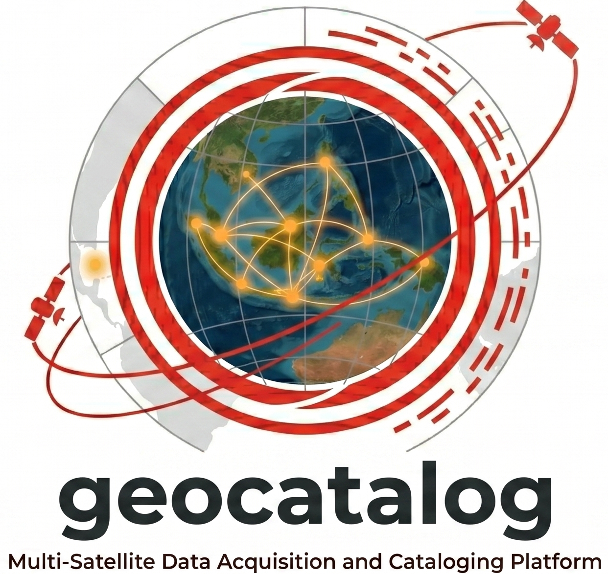

# GeoCatalog

<p align="center">
  
</p>

BRIN GeoCatalog is a standalone satellite and geospatial data catalog.

The catalog discovers files, extracts available metadata, indexes footprints and temporal metadata, and exposes the indexed datasets through a web interface, a read-only REST API, a STAC-compatible API surface, and Open Data Cube metadata exports.

## Goals

- Scan mounted folders without moving or rewriting source files.
- Recognize satellite imagery and geospatial data products from filenames, sidecar files, and internal metadata.
- Index search metadata in PostgreSQL/PostGIS.
- Support text, time, administrative boundary, coordinate, radius, bounding-box, and visual map search.
- Publish STAC-compatible collection and item endpoints.
- Generate Open Data Cube compatible product and dataset documents.
- Run every service through Docker Compose.

## Services

- `db`: PostgreSQL/PostGIS catalog database.
- `api`: read-only catalog API and STAC-compatible endpoints.
- `worker`: scanner and metadata extraction worker.
- `frontend`: MapLibre-based catalog web interface.
- `tiler`: placeholder service for future COG/raster tile previews.

## Technology Stack

- Python 3.14 for processing and API services.
- FastAPI for the catalog API.
- PostgreSQL + PostGIS for spatial indexing.
- PySTAC-compatible JSON payloads for STAC collections and items.
- Open Data Cube compatible YAML/JSON export endpoints.
- React + TypeScript + Vite + MapLibre for the frontend.
- Docker Compose for local and production-style deployment.

## Quick Start

Copy the example environment file if you want to override ports or scan paths:

```bash
cp .env.example .env
```

Build all containers:

```bash
docker compose build
```

Start the database, API, frontend, and tiler placeholder:

```bash
docker compose up
```

Run one scan of the mounted data folder:

```bash
docker compose run --rm worker geocatalog scan --root /data/geomimo
```

`/data/geomimo` is the path inside the worker container. By default Docker Compose mounts host `/mnt/geomimo-data` to that container path. To scan a different host folder, set `GEOCATALOG_SCAN_ROOT` in `.env`.

The scanner prints a start line and reports progress every 1000 supported candidate files. To make progress more frequent during testing:

```bash
docker compose run --rm worker geocatalog scan --root /data/geomimo --progress-interval 100
```

Running scans save a resume checkpoint every 100 processed candidate files by default. If the worker container is restarted before the scan completes, the next scan for the same `--root` resumes after the last checkpointed full path:

```bash
docker compose run --rm worker geocatalog scan --root /data/geomimo --checkpoint-interval 50
```

Disable resume for a deliberate full restart from the beginning:

```bash
docker compose run --rm worker geocatalog scan --root /data/geomimo --no-resume
```

Enable verbose folder enter/leave logs when debugging traversal:

```bash
docker compose run --rm worker geocatalog scan --root /data/geomimo --debug
```

Run the scanner continuously:

```bash
docker compose --profile service up worker-service
```

Run continuous scene-footprint backfill for indexed rasters:

```bash
docker compose --profile service up footprint-backfill-service
```

Run both long-running services together:

```bash
docker compose --profile service up worker-service footprint-backfill-service
```

Track a running or completed scan from the logs:

```bash
docker compose logs -f worker-service
```

For a one-time `docker compose run` scan, progress is printed directly in that terminal. From another terminal you can check whether the worker container is still running:

```bash
docker compose ps
```

Track scan status through the API:

```bash
curl http://localhost:8010/api/v1/status
curl http://localhost:8010/api/v1/scan-runs
```

Indexing is complete for a run when the latest scan run has `status: "completed"` and `finished_at` is not null. From Docker logs, completion is shown by a `scan completed ...` line.

Inspect database content from the host:

```bash
docker compose exec db psql -U geocatalog -d geocatalog -c "SELECT status, started_at, finished_at, scanned_files, indexed_files, updated_files, unchanged_files, removed_files, skipped_files FROM scan_runs ORDER BY started_at DESC LIMIT 5;"
docker compose exec db psql -U geocatalog -d geocatalog -c "SELECT platform, count(*) FROM datasets GROUP BY platform ORDER BY count DESC;"
docker compose exec db psql -U geocatalog -d geocatalog -c "SELECT count(*) AS total, count(*) FILTER (WHERE footprint IS NOT NULL) AS with_footprint FROM datasets;"
```

Dataset identity is based on the full `source_path`. If a later scan sees the same full path with the same fingerprint, it is counted as `unchanged_files` and left as-is. If the same full path changes, it is counted as `updated_files`. The same filename in a different folder is indexed as a separate dataset because its full path is different.

The worker also reconciles each visited folder. If a previously indexed file path no longer exists in that exact folder, the stale catalog row is removed and counted as `removed_files`. If the file has been moved to another folder, it will be indexed again under its new full path when that new folder is scanned.

Raster scene footprints are extracted during indexing when GDAL/Rasterio can open the file and the raster has a valid CRS. Footprints populate `datasets.bbox` and `datasets.footprint`, which enables map overlays and administrative-area filtering.

Load Indonesian administrative reference boundaries:

```bash
docker compose run --rm worker geocatalog import-reference --level province --file /app/data/reference/provinces.geojson
docker compose run --rm worker geocatalog import-reference --level kabupaten --file /app/data/reference/kabupaten.geojson
docker compose run --rm worker geocatalog import-reference --level kecamatan --file /app/data/reference/kecamatan.geojson
```

Access:

- Frontend: `http://localhost:8090`
- Catalog API: `http://localhost:8010/api/v1`
- API docs: `http://localhost:8010/docs`
- STAC root: `http://localhost:8010/stac`
- PostGIS from host tools: `localhost:55432`

## API Overview

- `GET /api/v1/health`
- `GET /api/v1/status`
- `GET /api/v1/platforms`
- `GET /api/v1/scan-runs`
- `GET /api/v1/source-files`
- `GET /api/v1/datasets`
- `GET /api/v1/datasets/{dataset_id}`
- `GET /api/v1/datasets/{dataset_id}/odc`
- `GET /api/v1/search`
- `GET /api/v1/locations`
- `GET /api/v1/boundary`
- `GET /stac`
- `GET /stac/collections`
- `GET /stac/collections/{collection_id}`
- `GET /stac/collections/{collection_id}/items`
- `GET /stac/collections/{collection_id}/items/{item_id}`
- `POST /stac/search`

## Search Modes

The API is designed to support:

- free text search
- dataset type, source, platform, and sensor search
- date/time range search
- province, kabupaten/kota, and kecamatan filters
- point and radius search
- bbox search
- map-drawn polygon search

Administrative boundary search expects province, kabupaten/kota, and kecamatan reference tables to be loaded into PostGIS. The initial schema includes placeholders for these boundaries so this can be connected without changing the API contract.

## Current Satellite Recognition

The scanner can index supported geospatial file types from any folder. It currently recognizes these satellite/platform families from folder names and filenames:

- Aqua / Terra: MODIS
- SNPP / NOAA-20: VIIRS
- Landsat-8 / Landsat-9: OLI-TIRS
- Sentinel-1A: C-SAR
- Sentinel-2A / Sentinel-2B / Sentinel-2C: MSI
- Gaofen-1 / Gaofen-1B / Gaofen-1C / Gaofen-1D: PMS, WFV, WFC, or generic optical when the sensor is not explicit
- GeoEye-1: GEIS
- Pleiades-1A / Pleiades-1B: HiRI
- Pleiades-Neo3 / Pleiades-Neo4: Neo Imager
- SPOT-6 / SPOT-7: NAOMI
- WorldView-2 / WorldView-3: WV110
- ZiYuan-302: MUX

Supported image and geospatial extensions include GeoTIFF, JP2/J2K, NITF, IMG, VRT, HDF/HDF5, NetCDF, GeoJSON, GeoPackage, Shapefile, and FlatGeobuf.

## Open Data Cube Compatibility

GeoCatalog keeps STAC-like records as the primary catalog model. Open Data Cube compatibility is exposed through export endpoints that generate ODC-style dataset documents from indexed records. A later phase can add direct `datacube dataset add` integration if an ODC database is available.

## Development Notes

The initial scanner indexes common geospatial extensions and records conservative metadata from the filesystem and filename. Raster/HDF/NetCDF internal metadata extraction should be expanded incrementally with GDAL/Rasterio/xarray handlers per product family.

## License


This project is licensed under the [BSD 3-Clause License](LICENSE).

Copyright (c) 2026, Andria Arisal (BRIN).
